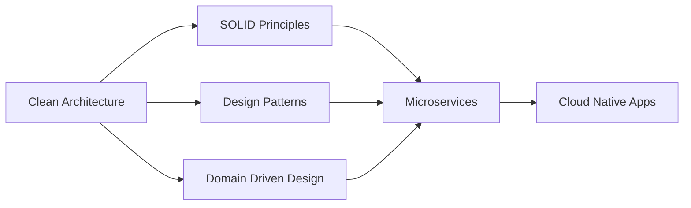

<div align="center">
  
# 👋 Hi, I'm Franco Barrera Riffo


<p align="center">
  <a href="https://x.com/Play10Never"></a>
  <a href="https://www.linkedin.com/in/franco-barrera-riffo/"></a>
  <a href="mailto:your.email@example.com"></a>
</p>


</div>

## 🚀 About Me

> **Full Stack Developer** passionate about creating scalable, high-performance applications using modern technologies and cloud infrastructure.

- 💼 Building **production-ready applications** with focus on clean architecture and best practices
- ☁️ Implementing **DevOps pipelines** and deploying to **AWS** and **Azure**
- 🏗️ Designing **microservices architectures** with containerization (Docker, Kubernetes)
- 📚 Constantly learning and improving: **Terraform, CI/CD, Design Patterns, and Cloud Native technologies**
- 🎯 Focused on delivering **exceptional user experiences** with modern UI/UX

---

## 🛠️ Tech Stack

### Frontend Development


### Backend Development


### Database & Storage


### DevOps & Cloud


### Tools & Others


---

## 🏗️ Architecture & Best Practices



### Core Principles I Follow:
- ✅ **Clean Architecture** - Separation of concerns and maintainable code
- ✅ **SOLID Principles** - Object-oriented design best practices
- ✅ **Design Patterns** - Factory, Repository, Strategy, Observer, and more
- ✅ **Domain Driven Design (DDD)** - Business logic first approach
- ✅ **Test Driven Development (TDD)** - Reliable and tested code
- ✅ **Microservices Architecture** - Scalable and distributed systems
- ✅ **CI/CD Pipelines** - Automated testing and deployment

---

## 🌱 Currently Learning & Improving

<table>
  <tr>
    <td align="center" width="33%">
      
      <br><strong>Kubernetes</strong>
      <br>Container Orchestration
    </td>
    <td align="center" width="33%">
      
      <br><strong>Terraform</strong>
      <br>Infrastructure as Code
    </td>
    <td align="center" width="33%">
      
      <br><strong>AWS & Azure</strong>
      <br>Cloud Architecture
    </td>
  </tr>
  <tr>
    <td align="center">
      
      <br><strong>Docker</strong>
      <br>Containerization
    </td>
    <td align="center">
      
      <br><strong>CI/CD</strong>
      <br>Automation & Deployment
    </td>
    <td align="center">
      
      <br><strong>NestJS</strong>
      <br>Enterprise Backend
    </td>
  </tr>
</table>

---

## 💼 Featured Projects

> A curated selection of my most impactful projects showcasing expertise in Full Stack Development, DevOps, and Cloud Architecture

<table>
<tr>
<td width="50%" valign="top">

### 🤖 Meet AI Platform
**AI-Powered Learning Platform**

Comprehensive platform for AI-assisted learning with conversation capabilities and progressive course system.

**Tech Stack:**
- Next.js 15, TypeScript
- Better Auth, Polar
- AI Agents Integration

[🔗 Live Demo](https://meet-ai-platform.vercel.app/) • [💻 Code](https://github.com/Lostovayne/meet-ai-platform)

</td>
<td width="50%" valign="top">

### 🎥 Screen Recording Platform
**Professional Screen Capture Solution**

High-quality screen recording and video sharing platform designed for content creators with cloud storage.

**Tech Stack:**
- Next.js 15, TypeScript
- Better-Auth, Bunny CDN
- Tailwind 4, Drizzle, Xata

[🔗 Live Demo](https://screen-recording-platform.vercel.app/) • [💻 Code](https://github.com/Lostovayne/screen-recording-platform)

</td>
</tr>

<tr>
<td width="50%" valign="top">

### 💼 AI Interview Simulator
**Smart Interview Preparation Tool**

Realistic interview simulation with AI-generated questions, real-time feedback, and performance analytics.

**Tech Stack:**
- Next.js 15, TypeScript
- Tailwind 4, Firebase
- AI Workflows

[🔗 Live Demo](https://ai-interview-simulator.vercel.app/) • [💻 Code](https://github.com/Lostovayne/ai-interview-simulator)

</td>
<td width="50%" valign="top">

### 🎬 YouTube Clone
**Full-Featured Video Platform**

Complete video platform with user interactions, subscriptions, and YouTube-inspired UI/UX.

**Tech Stack:**
- Next.js 15, TypeScript
- TRPC, Tailwind
- AI Workflows Integration

[💻 View Code](https://github.com/Lostovayne/youtube-clone)

</td>
</tr>

<tr>
<td width="50%" valign="top">

### 🚀 YC Startup Directory
**Startup Discovery Platform**

Explore and connect with innovative startups. Perfect for networking and investors to find opportunities.

**Tech Stack:**
- Next.js 15, TypeScript
- Sanity CMS
- Modern UI/UX

[🔗 Live Demo](https://yc-directory-topaz.vercel.app/) • [💻 Code](https://github.com/Lostovayne/yc-directory)

</td>
<td width="50%" valign="top">

### 🛍️ ShopperPro E-commerce
**Scalable Online Store Platform**

Full-featured e-commerce with inventory management, secure payments via Stripe, and admin dashboard.

**Tech Stack:**
- Next.js, TypeScript
- Stripe API, Sanity
- Headless CMS

[🔗 Live Demo](https://shoper-store.vercel.app/)

</td>
</tr>

<tr>
<td width="50%" valign="top">

### 🛒 ChileanRop E-commerce
**Localized Shopping Experience**

E-commerce platform optimized for the Chilean market with sleek UI and efficient checkout flow.

**Tech Stack:**
- Next.js 15, TypeScript
- Tailwind 4, Prisma
- Shadcn UI Components

[🔗 Live Demo](https://ropachilena-pro.vercel.app/) • [💻 Code](https://github.com/Lostovayne/ropachilena-nextjs)

</td>
<td width="50%" valign="top">

### 🎨 MotionCraft Experience
**Immersive Web Animation**

Visually stunning web experience featuring dynamic GSAP animations and immersive interactive design.

**Tech Stack:**
- React 19, TypeScript
- GSAP Animations
- Tailwind CSS

[🔗 Live Demo](https://winning-web.vercel.app/)

</td>
</tr>

<tr>
<td width="50%" valign="top">

### ⛓️ BlockForge Interface
**Modern Blockchain Dashboard**

Clean and intuitive blockchain application interface with modern UI components and secure transaction flows.

**Tech Stack:**
- Astro, React
- Framer Motion
- TypeScript

[🔗 Live Demo](https://dark-blockchain.vercel.app/)

</td>
<td width="50%" valign="top">

### 📊 PingPanda Analytics
**Real-Time Discord Insights**

Powerful Discord analytics dashboard with WebSocket-powered real-time statistics and user insights.

**Tech Stack:**
- Next.js 14, TypeScript
- Hono.js, WebSockets
- Tailwind CSS

[🔗 Live Demo](https://ping-panda-hazel.vercel.app/)

</td>
</tr>

<tr>
<td width="50%" valign="top">

### 📚 University Library System
**Enterprise Library Management**

Complete library management system with advanced security, Redis caching, and workflow automation.

**Tech Stack:**
- Next.js, TypeScript
- PostgreSQL, Redis
- Docker, Auth.js, Workflows

[💻 View Code](https://github.com/Lostovayne/sistema-biblioteca-universitaria)

</td>
<td width="50%" valign="top">

### 🏠 Property Rental Platform
**Full-Stack Rental Application**

Enterprise-grade rental platform with geolocation, cloud storage (AWS S3), and AWS Cognito authentication.

**Tech Stack:**
- Next.js, TypeScript
- AWS Cognito, AWS S3
- PostgreSQL, Mapbox

[💻 View Code](https://github.com/Lostovayne/Aplicacion-de-alquiler-de-propiedades)

</td>
</tr>
</table>

---

## 📊 GitHub Stats

<div align="center">
  
  
  
  
  
  

</div>

---

## 🎯 What I Bring to the Table

```typescript
const franco = {
  code: ["TypeScript", "JavaScript", "Python"],
  technologies: {
    frontend: ["Next.js", "React", "Tailwind CSS", "Astro"],
    backend: ["Node.js", "NestJS", "tRPC", "Hono"],
    databases: ["PostgreSQL", "MongoDB", "Redis"],
    devOps: ["Docker", "Kubernetes", "Terraform", "GitHub Actions"],
    cloud: ["AWS", "Azure", "Vercel"],
    architecture: ["Microservices", "Clean Architecture", "DDD", "SOLID"]
  },
  currentFocus: "Building scalable cloud-native applications",
  funFact: "I debug with console.log and I'm not ashamed 😄"
};
```

---

## 📫 Let's Connect!

<div align="center">

### 💼 Open to Work | 🤝 Available for Collaborations

If you're looking for a **Full Stack Developer** who is passionate about:
- 🚀 Building **scalable** and **performant** applications
- ☁️ Implementing **modern DevOps** practices
- 🏗️ Designing **clean architectures** with best practices
- 📚 Continuous learning and **staying updated** with latest technologies

**Let's build something amazing together!**

[](https://x.com/Play10Never)
[](https://www.linkedin.com/in/franco-barrera-riffo/)
[](mailto:your.email@example.com)


**⭐ From [Lostovayne](https://github.com/Lostovayne) with 💙**

</div>